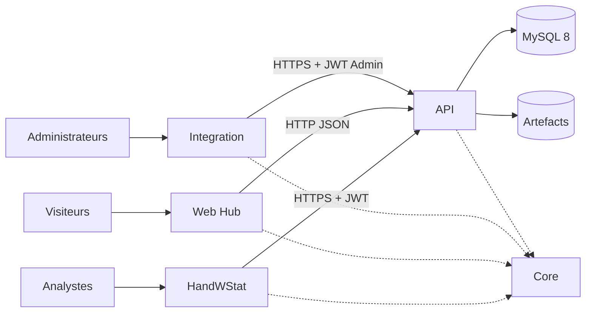

# Architecture — écosystème Handball

> Documentation générée le 23 juillet 2026 sur la branche
> `docs/full-ecosystem-architecture`.

L’écosystème actif comprend un client analytique MAUI Blazor Hybrid
(HandWStat), une API ASP.NET Core adossée à MySQL 8, un hub Web Blazor, un outil
d’import WPF et une bibliothèque de contrats partagée.

## Documentation

- [Guide de lecture](docs/architecture/00-README.md)
- [Vue globale](docs/architecture/01-ECOSYSTEM-OVERVIEW.md)
- [Applications](docs/architecture/02-APPLICATIONS.md)
- [Données et MySQL](docs/architecture/03-DATA-AND-MYSQL.md)
- [Serveur et réseau](docs/architecture/04-SERVER-AND-NETWORK.md)
- [Sécurité](docs/architecture/05-SECURITY.md)
- [CI/CD et releases](docs/architecture/06-CI-CD-AND-RELEASES.md)
- [Runbook](docs/architecture/07-OPERATIONS-RUNBOOK.md)
- [Risques et roadmap](docs/architecture/08-RISKS-AND-ROADMAP.md)
- [Configuration](docs/architecture/09-CONFIGURATION-REFERENCE.md)
- [Rapport final](DOCUMENTATION_REPORT.md)

## Alertes principales

- **P0** — deux catégories d’identifiants sensibles sont versionnées :
  configuration Integration et scripts MySQL. Les valeurs ne sont pas
  reproduites ; rotation immédiate requise.
- **P1** — les scripts SQL de release sont en syntaxe Oracle, incompatible avec
  la cible MySQL/Pomelo déclarée.
- **P1** — aucune CI/CD, sauvegarde restaurable, supervision ou procédure de
  rollback automatisée n’a été trouvée.
- **P1** — plusieurs clients composent des routes pouvant produire un double
  segment `/api`.

## Statut

La documentation des éléments accessibles est complète. Reverse proxy, services
Web/MySQL, sauvegardes, topologie physique et éventuelle infrastructure MCP
restent explicitement **À CONFIRMER**.

