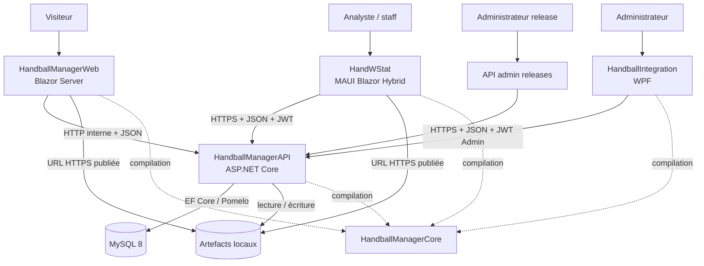
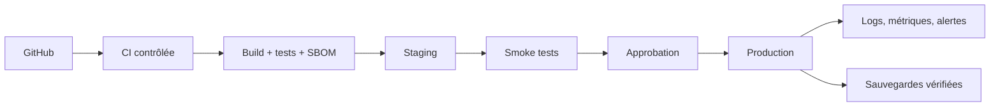

# Vue globale de l’écosystème

## Objectif

Donner à un développeur, un exploitant ou un responsable projet une vue cohérente
du système réellement observé, de ses utilisateurs et du sens des flux.

## Architecture actuelle

**CONFIRMÉ** — L’écosystème collecte et transforme des données de matchs de
handball, les stocke dans une base relationnelle, puis les expose sous forme de
référentiels, statistiques, analyses et packages applicatifs.

### Utilisateurs et composants

| Utilisateur | Composant principal | Usage observé |
|---|---|---|
| Analyste, staff, consultation | HandWStat | Tableaux de bord, joueurs, équipes, matchs, comparaisons et profils de poste |
| Administrateur de données | HandballIntegration | Import CSV/XLSX, résolution des joueurs/équipes, administration de données |
| Visiteur | HandballManagerWeb | Inscription et téléchargement des releases publiées |
| Administrateur de release | API d’administration | Création, enrichissement, publication et révocation d’une release |
| Développeur/exploitant | Swagger, scripts et dépôts | Diagnostic, migrations et exploitation manuelle |

### Composants et responsabilités

| Composant | Technologie | Responsabilité |
|---|---|---|
| HandWStat | .NET 10, MAUI Blazor Hybrid | Client analytique multi-plateforme |
| HandballManagerAPI | ASP.NET Core 8, EF Core 8, Pomelo | Métier, authentification, statistiques, accès MySQL, releases |
| HandballManagerWeb | Blazor Web App .NET 8, rendu serveur interactif | Hub public, inscription, téléchargement |
| HandballIntegration | WPF .NET 8 | Import et contrôle de données par un administrateur |
| HandballManagerCore | Bibliothèque .NET 8 | DTO, modèles et contrats partagés |
| MySQL | Version déclarée `8.0.36` | Persistance centrale |
| Stockage de fichiers | Répertoires locaux du serveur API | Installateurs historiques et artefacts de releases |

### Diagramme global confirmé

Source réutilisable : [ecosystem-current.mmd](diagrams/ecosystem-current.mmd).

### Sens des flux

1. **Import** — fichiers CSV ou XLSX → Integration → validation/résolution →
   endpoints administrateur de l’API → MySQL.
2. **Consultation** — HandWStat → authentification utilisateur → endpoints de
   référentiels et statistiques → affichage Blazor/ApexCharts.
3. **Inscription** — navigateur → Web → `POST /auth/register` → table des
   utilisateurs.
4. **Release** — administrateur → registre de releases de l’API → URL d’artefact
   publiée → Web et mécanisme de mise à jour HandWStat.
5. **Version système** — API → registre des versions de composants et historique
   de schéma → décision de compatibilité du client.

### Dépendances

**CONFIRMÉ** — Les quatre applications référencent directement le projet Core.
Les chemins sont relatifs dans API, Web et Integration. HandWStat résout Core par
une propriété MSBuild avec un chemin local `D:\repos` en premier choix, puis des
chemins relatifs.

**CONFIRMÉ** — HandballIntegration n’accède pas directement à MySQL dans le code
analysé ; il passe par l’API.

**CONFIRMÉ** — HandballManagerWeb appelle l’API côté serveur. Le navigateur reçoit
ensuite les liens HTTPS des artefacts.

## Environnements détectés

- **Développement local confirmé** : API `localhost:5000`, Web
  `localhost:5100`, profils HTTPS supplémentaires `7178` et `7100`.
- **Production probable** : Linux, systemd, répertoires sous `/home/opc`, API
  Kestrel sur le port `5000`.
- **URL publique confirmée dans les clients** :
  `https://handballwstat.ddnsfree.com/api/`.
- **Reverse proxy, DNS, certificat et hôte MySQL** : **À CONFIRMER**.

## Applications historiques ou statut à confirmer

- `D:\repos\HandballManagerMaui` : ancien client MAUI de saisie/import, encore
  compilable potentiellement contre Core mais non référencé par les solutions
  actives.
- `D:\repos\ouicelino26\HANDBALLSTAT` : client WPF historique avec base SQLite
  embarquée.

Leur statut de retrait, leurs utilisateurs et leur éventuelle présence en
production sont **À CONFIRMER**.

## Éléments manquants

- aucun dépôt ou déploiement de serveur MCP trouvé ;
- aucun workflow CI/CD actif trouvé ;
- aucune configuration de reverse proxy, firewall ou certificat ;
- aucune procédure de sauvegarde MySQL versionnée ;
- aucun manifeste Docker, service systemd versionné ou supervision centralisée ;
- topologie physique et noms des serveurs non disponibles.

## Architecture cible recommandée

La cible ajoute une chaîne reproductible, un gestionnaire de secrets, des
health checks, des sauvegardes restaurables et un rollback par version. Elle ne
décrit pas l’état actuel.

## Sources

- `<HandWStat>/HandWStat.csproj`, `MauiProgram.cs`, `Components/Routes.razor`
- `<HandWStat>/Services/Api/*`, `Services/Updates/AppUpdateService.cs`
- `<HandballManagerAPI>/HandballManagerAPI/Program.cs`
- `<HandballManagerAPI>/HandballManagerAPI/Datas/HBdbcontext.cs`
- `<HandballManagerAPI>/HandballManagerWeb/Program.cs`
- `<HandballManagerAPI>/HandballManagerWeb/Services/ReleaseClient.cs`
- `<HandballIntegration>/HandballIntegration/App.xaml.cs`
- `<HandballIntegration>/HandballIntegration/ViewModels/*`
- fichiers `.csproj` des cinq composants actifs

