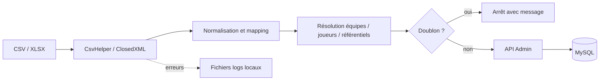

# Applications actives

## Objectif

Présenter une fiche opérationnelle compacte pour chaque application active. Les
états de build et de tests sont consolidés dans le rapport final.

## Architecture actuelle

### HandWStat

| Champ | Description |
|---|---|
| Nom | HandWStat Studio |
| Rôle | Client d’analyse statistique et d’aide à la décision |
| Utilisateurs | Analystes, staff, comptes `Consultation` ou `Admin` |
| Technologie | .NET 10, .NET MAUI, Blazor Hybrid, ApexCharts |
| Point d’entrée | `MauiProgram.CreateMauiApp`, `MainPage` et composant `Routes` |
| Fonctionnalités principales | Dashboard, joueurs, équipes, matchs, comparaison, profils de poste, recherche globale |
| Entrées | JSON de l’API, identifiants utilisateur, métadonnées de version |
| Sorties | Visualisations, exports SVG côté composants, événements anonymisés de mise à jour |
| Dépendances internes | HandballManagerCore par `ProjectReference` |
| Dépendances externes | MAUI, Blazor WebView, ApexCharts, API HTTP |
| Configuration | `appsettings.json` embarqué ; `ApiSettings:BaseUrl` |
| Authentification | `POST auth/login`, JWT Bearer conservé uniquement dans la session mémoire |
| Base de données | Aucun accès direct |
| Déploiement | Cibles Android, iOS, MacCatalyst et Windows ; packaging automatisé non trouvé |
| Logs | Debug en compilation DEBUG ; `ILogger` dans quelques composants |
| Tests | Projet xUnit ciblant surtout le mécanisme de mise à jour |
| État observé | Client actif, mécanisme de mise à jour et versioning présents |
| Limites | Core local, token non persistant, configuration embarquée, pas de télémétrie centralisée |

Pages routées confirmées : `/`, `/dashboard`, `/players`, `/teams`, `/matches`,
`/compare`, `/position-profiles`, `/demo`, `/counter` et `/update-required`.

Le démarrage déclenche un contrôle de mise à jour. Une version obligatoire
remplace le routeur par l’écran de blocage ; une version facultative ouvre une
boîte de dialogue. Le client envoie version, build, plateforme, architecture et
un identifiant local haché. Il n’installe pas lui-même l’artefact : il ouvre une
URL HTTPS externe.

**Limite confirmée** — la base d’URL configurée se termine par `/api/`, alors que
plusieurs clients de données ajoutent encore `api/` à leurs routes. Les routes
d’authentification et de mise à jour n’ajoutent pas ce second segment. La
résolution effective par le reverse proxy est **À CONFIRMER**.

Sources :

- `<HandWStat>/HandWStat.csproj`, `Directory.Build.props`
- `<HandWStat>/MauiProgram.cs`, `MainPage.xaml`
- `<HandWStat>/Components/Routes.razor`
- `<HandWStat>/Models/Navigation/AppNavigationCatalog.cs`
- `<HandWStat>/Services/ApiAuthService.cs`, `Services/Api/*`
- `<HandWStat>/Services/Updates/*`

### HandballManagerAPI

| Champ | Description |
|---|---|
| Nom | HandballManagerAPI |
| Rôle | Façade métier, analytique, authentification, persistance et registre de releases |
| Utilisateurs | Clients HandWStat/Web/Integration, administrateurs et développeurs |
| Technologie | ASP.NET Core 8, EF Core 8, Pomelo MySQL, Swagger |
| Point d’entrée | `Program.cs` |
| Fonctionnalités principales | Auth, référentiels, joueurs, équipes, matchs, statistiques, imports de temps, releases, versions système |
| Entrées | HTTP JSON, formulaires/fichiers d’import API, options de ligne de commande |
| Sorties | JSON, JWT, installateurs/artefacts statiques, logs structurés |
| Dépendances internes | HandballManagerCore |
| Dépendances externes | MySQL, système de fichiers, ClosedXML |
| Configuration | `appsettings*.json` et variables d’environnement ASP.NET Core |
| Authentification | JWT HMAC ; login 4 h ; client credentials 2 h |
| Base de données | Accès exclusif via `HBdbcontext` et repositories/services |
| Déploiement | Kestrel écoute toutes les interfaces sur `5000` ; service `handapi` probable |
| Logs | `ILogger` et sortie standard ; journal systemd probable |
| Tests | xUnit, serveur de test ASP.NET, EF InMemory |
| État observé | API riche, versionnée seulement par Swagger `v1` documentaire |
| Limites | Pas de CORS explicite, health check, cache, rate limiting ou logs centralisés |

Synthèse des endpoints :

| Domaine | Routes structurantes | Accès |
|---|---|---|
| Authentification | `/auth/token`, `/auth/login`, `/auth/register` | Anonyme |
| Référentiels | `/api/Lookups`, Attacks, Defenses, Event, Positions, Nationalities | Admin/Consultation ; mutations Admin |
| Joueurs | `/api/Players`, recherche, profil, matchs, profil de poste | Lecture Admin/Consultation ; mutations Admin |
| Équipes | `/api/Teams` et `/teams`, recherche par code/nom | Admin/Consultation |
| Matchs | `/api/Matches`, `/api/MatchEvents`, `/api/TimePlayers` | Lecture partagée ; mutations Admin |
| Statistiques | `/api/Stats/*`, `/api/StatPlayer/*` | Admin/Consultation |
| Releases | `/api/releases/*`, `/api/client-updates/*` | Public en lecture/événements |
| Administration | `/api/admin/releases/*`, utilisateurs, versions de composants | Admin |
| Système | `/api/system/version` | Public |

Le code enregistre des services analytiques spécialisés, un repository de
releases et des services d’import. Swagger et Swagger UI sont activés sans
condition d’environnement. Le démarrage normal ne lance pas automatiquement
`Database.Migrate()` ; cette opération existe seulement dans deux modes CLI
spécifiques (`--seed-admin`, `--import-sah-total`).

Sources :

- `<HandballManagerAPI>/HandballManagerAPI/Program.cs`
- `<HandballManagerAPI>/HandballManagerAPI/Controllers/*`
- `<HandballManagerAPI>/HandballManagerAPI/Analytics/*`
- `<HandballManagerAPI>/HandballManagerAPI/Datas/HBdbcontext.cs`
- `<HandballManagerAPI>/HandballManagerAPI/Repositories/Releases/*`
- `<HandballManagerAPI>/HandballManagerAPI/Services/*`

### HandballManagerWeb

| Champ | Description |
|---|---|
| Nom | HandballManagerWeb |
| Rôle | Hub public d’inscription et de téléchargement |
| Utilisateurs | Visiteurs et nouveaux utilisateurs |
| Technologie | Blazor Web App .NET 8, composants interactifs serveur |
| Point d’entrée | `Program.cs` |
| Fonctionnalités principales | Accueil, inscription, affichage des artefacts HandWStat publiés |
| Entrées | Formulaire d’inscription, registre de releases de l’API |
| Sorties | HTML serveur, appels API, liens de téléchargement HTTPS |
| Dépendances internes | HandballManagerCore |
| Dépendances externes | API via clients HTTP nommés |
| Configuration | `HandballApi`, `Hub`, logs, environnement ASP.NET Core |
| Authentification | Aucune session applicative Web ; inscription publique déléguée à l’API |
| Base de données | Aucun accès direct |
| Déploiement | Port local `5100`, HTTPS local `7100`; production à confirmer |
| Logs | Logging ASP.NET Core ; avertissements de `ReleaseClient` |
| Tests | Aucun projet de tests Web distinct détecté |
| État observé | Hub actif consommant le registre centralisé |
| Limites | Pas de health check, statut de service systemd et reverse proxy absents |

Le Web valide côté affichage la présence d’une taille, d’un SHA-256 et d’une URL
HTTPS avant de rendre un lien téléchargeable. La section `Hub:Applications`
historique est toujours configurée, mais la page d’accueil actuelle utilise le
registre de releases.

Sources :

- `<HandballManagerAPI>/HandballManagerWeb/Program.cs`
- `<HandballManagerAPI>/HandballManagerWeb/Services/RegistrationClient.cs`
- `<HandballManagerAPI>/HandballManagerWeb/Services/ReleaseClient.cs`
- `<HandballManagerAPI>/HandballManagerWeb/Components/Pages/*`
- `<HandballManagerAPI>/HandballManagerWeb/appsettings.json`

### HandballIntegration

| Champ | Description |
|---|---|
| Nom | HandballIntegration |
| Rôle | Poste d’administration pour importer et corriger les données |
| Utilisateurs | Administrateurs |
| Technologie | WPF .NET 8, MVVM Toolkit, CsvHelper, ClosedXML |
| Point d’entrée | `App`, hôte générique .NET, fenêtre de login puis `MainWindow` |
| Fonctionnalités principales | Import CSV de matchs/événements, import XLSX de temps de jeu, gestion joueurs/utilisateurs |
| Entrées | CSV `;`, classeur XLSX, saisies administrateur |
| Sorties | Requêtes HTTP JSON vers l’API, fichiers de logs locaux |
| Dépendances internes | HandballManagerCore |
| Dépendances externes | API, système de fichiers Windows |
| Configuration | `ApiSettings` dans `appsettings.json` copié dans la sortie |
| Authentification | Login utilisateur ; accès refusé si le rôle n’est pas `Admin` |
| Base de données | Aucun accès direct détecté |
| Déploiement | Exécutable Windows WPF ; packaging/installateur non trouvé |
| Logs | `integration_errors.log`, `integration_skips.log`, `integration_halftime.log`, `integration_time_errors.log` |
| Tests | Aucun projet de tests détecté |
| État observé | Import interactif, modifications locales utilisateur non commitée présentes |
| Limites | Secret versionné, logs locaux, reprises partielles, routes composées de façon incohérente |

Pipeline d’import confirmé :

L’import de match recherche un match identique et compare ses événements avant
création. L’import de temps refuse un match ayant déjà des lignes de temps. Cette
protection donne une idempotence partielle ; il n’existe pas de transaction
globale observée entre la création d’un match et l’envoi successif de ses
événements. Une interruption peut donc laisser un import partiel.

**Limite confirmée** — comme HandWStat, Integration combine une base publique
terminée par `/api/` avec plusieurs routes commençant par `api/`, tandis que
d’autres routes commencent directement par `teams/` ou `auth/`.

Sources :

- `<HandballIntegration>/HandballIntegration/App.xaml.cs`
- `<HandballIntegration>/HandballIntegration/Services/*`
- `<HandballIntegration>/HandballIntegration/ViewModels/IntegrationViewModel.cs`
- `<HandballIntegration>/HandballIntegration/ViewModels/TimeIntegrationViewModel.cs`
- `<HandballIntegration>/HandballIntegration/Data/CsvMappings/MatchFileMap.cs`

### HandballManagerCore

| Champ | Description |
|---|---|
| Nom | HandballManagerCore |
| Rôle | Contrats et modèle partagé |
| Utilisateurs | Les quatre applications actives à la compilation |
| Technologie | Bibliothèque .NET 8 sans package externe |
| Point d’entrée | Aucun ; bibliothèque de classes |
| Fonctionnalités principales | DTO analytics/import/release et modèles de domaine |
| Entrées/sorties | Types compilés partagés |
| Dépendances internes | Aucune |
| Dépendances externes | Framework .NET uniquement |
| Configuration/auth/base/déploiement/logs | Sans objet |
| Tests | Aucun projet de tests Core distinct |
| État observé | Référencé directement depuis les dépôts consommateurs |
| Limites | Couplage de source et coordination multi-dépôts |

Les familles confirmées sont : analytics, matchs, joueurs, temps de jeu,
imports, releases, utilisateurs et rôles. Les modèles EF sont également partagés
avec les clients, ce qui augmente le risque de couplage entre persistance et
contrats d’API.

Sources :

- `<HandballManagerCore>/HandballManagerCore/DTO/*`
- `<HandballManagerCore>/HandballManagerCore/Models/*`
- `<HandballManagerCore>/HandballManagerCore/HandballManagerCore.csproj`
- références de projet dans les quatre `.csproj` consommateurs

### Serveur MCP

**À CONFIRMER** — aucun dépôt `handball-ecosystem-mcp`, manifeste, transport,
catalogue d’outils ou configuration Ollama propre à l’écosystème n’a été trouvé.
Il n’est donc pas présenté comme composant déployé.

## Architecture cible recommandée

- publier Core comme package versionné ou réunir les composants dans un
  monorepo cohérent ;
- introduire une classe unique de composition des URL par client ;
- isoler modèles de persistance et DTO publics ;
- ajouter health checks, observabilité et politiques de résilience HTTP ;
- rendre les imports transactionnels ou compensables, avec identifiant
  d’idempotence ;
- documenter et automatiser le packaging Windows/Android.

