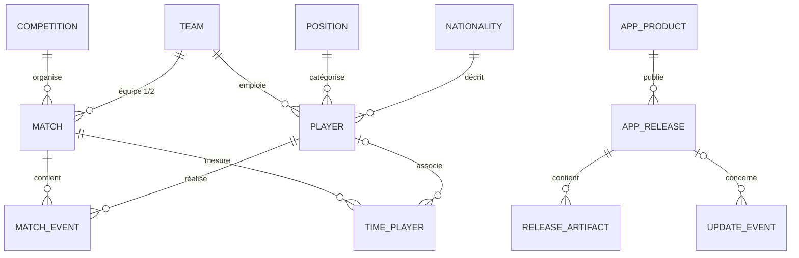
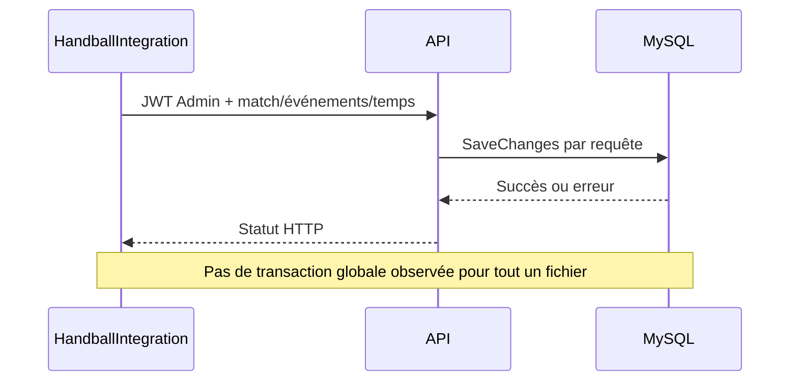

# Données et MySQL

## Objectif

Décrire la persistance centrale, ses domaines, ses producteurs et consommateurs,
ainsi que la stratégie de migration réellement présente.

## Architecture actuelle

### Moteur et accès

- **CONFIRMÉ** — l’API cible MySQL ; la version configurée est `8.0.36`.
- **CONFIRMÉ** — provider `Pomelo.EntityFrameworkCore.MySql 8.0.3` et EF Core 8.
- **CONFIRMÉ** — `HBdbcontext` est l’unique `DbContext` actif.
- **CONFIRMÉ** — HandWStat, Web et Integration n’ouvrent pas de connexion SQL ;
  ils passent par l’API.
- **À CONFIRMER** — hôte, port, nom de base, disponibilité, réplication et
  paramètres de chiffrement MySQL de production.

La chaîne `ConnectionStrings:HandDbCon` est vide dans le fichier versionné et
doit être fournie par une source de configuration sécurisée. Le démarrage hors
environnement `Testing` échoue si elle est absente.

### Domaines de données

| Domaine | Tables/ensembles principaux | Écrit par | Lu par | Sensibilité | Remarques |
|---|---|---|---|---|---|
| Authentification | `Users` | API Auth/Admin | API | Élevée | Identité, rôle, hash et sel de mot de passe |
| Référentiels | `Competitions`, `Nationalites`, `Positions`, `Events`, `Attacks`, `Defenses` | API Admin | API puis clients | Faible à moyenne | Index sur codes et noms |
| Équipes | `Teams` | API Admin | API, HandWStat, Integration | Moyenne | Logo et code d’équipe |
| Joueurs | `Players` | API Admin/Integration | API, HandWStat, Integration | Moyenne | Identité, date de naissance, photo, statut |
| Matchs | `Matchs`, `MatchEvents` | API Admin/Integration | API, HandWStat | Moyenne | Relations équipes/joueurs/événements |
| Temps/statistiques | `TimePlayers`, `HistoMatches`, `HistoPlayers` | API/Integration | API analytique | Moyenne | Temps de jeu et historiques |
| Releases | `APP_PRODUCT`, `APP_RELEASE`, `APP_RELEASE_ARTIFACT`, `SYS_COMPONENT_VERSION` | API Admin | API, Web, HandWStat | Moyenne | Métadonnées, compatibilité, SHA-256, URLs |
| Événements de mise à jour | `APP_UPDATE_EVENT` | API publique de télémétrie | API/exploitation | Moyenne | Identifiant d’appareil haché et erreurs |
| Historique de schéma | `DB_MIGRATION_HISTORY`, historique EF | Outil de migration | API/exploitation | Élevée | Version de base exposée par `/api/system/version` |

### Relations principales

Source réutilisable : [data-domains.mmd](diagrams/data-domains.mmd).

Les deux relations de `Match` vers `Team` utilisent une suppression restreinte.
Les temps de jeu sont supprimés avec le match, mais conservent une référence
joueur nullable en cas de suppression du joueur. Les artefacts sont supprimés en
cascade avec leur release.

### Index et conventions

`HBdbcontext` ajoute des index sur les dates/saisons/journées des matchs, les
clés de `MatchEvent`, les équipes/positions/nationalités des joueurs et les
recherches de temps de jeu. Les champs `Season` et `Day` sont normalisés en
majuscules et sans espaces lors des sauvegardes EF.

Les tables historiques utilisent les conventions EF issues des `DbSet`. Le
registre de releases emploie explicitement des noms de tables et colonnes en
majuscules (`APP_*`, `SYS_*`, `DB_*`) avec des booléens `Y/N`.

### Migrations

Deux mécanismes coexistent :

1. **Migrations EF Core MySQL confirmées** dans
   `HandballManagerAPI/Migrations`, de `InitialSync` (août 2025) à
   `AddReleaseRegistry` (juillet 2026).
2. **Scripts SQL manuels** sous `database/migrations`.

**ÉCART IMPORTANT CONFIRMÉ** — les scripts `database/migrations` utilisent
SQL*Plus, `DUAL`, `VARCHAR2`, séquences et dictionnaire Oracle. Ils ne sont pas
compatibles tels quels avec le runtime MySQL/Pomelo déclaré par l’API. Leur
cible réelle est **À CONFIRMER**. Ils ne doivent pas être exécutés sur MySQL.

Deux scripts shell distincts appliquent directement des modifications MySQL à
la table des matchs et redémarrent le service API. Ils ne constituent pas un
moteur de migration transactionnel général.

Le démarrage normal de l’API n’exécute pas les migrations. `Database.Migrate()`
n’est appelé que dans les modes CLI de création d’administrateur et d’import de
classeur de saison.

### Sauvegarde, restauration et rétention

**À CONFIRMER** — aucun script de sauvegarde, plan de rétention, réplication,
test de restauration ou objectif RPO/RTO n’a été trouvé.

Le rollback SQL du registre de releases est un script Oracle destructif qui
supprime les six tables et leurs données après confirmation explicite. Ce n’est
pas un rollback compatible MySQL ni un remplacement d’une restauration de
sauvegarde.

## Flux d’écriture

## Risques et limites

- P0 : identifiants MySQL présents dans des scripts versionnés ;
- P1 : scripts Oracle mélangés à une architecture MySQL ;
- P1 : absence de sauvegarde/restauration vérifiée ;
- P1 : migrations manuelles et redémarrage de service dans un script ;
- P1 : import multi-requêtes pouvant rester partiel ;
- P2 : modèles de persistance partagés via Core avec les clients ;
- P2 : absence de stratégie documentée de purge des événements de mise à jour.

## Architecture cible recommandée

- désigner MySQL 8 comme cible unique et retirer/quarantainer les scripts Oracle,
  ou documenter explicitement un second moteur s’il existe ;
- utiliser un seul mécanisme de migration versionné, testé sur un clone ;
- sauvegarder avant migration et tester périodiquement la restauration ;
- exécuter les migrations avec un compte dédié à privilèges temporaires ;
- définir RPO, RTO, rétention et purge de télémétrie ;
- rendre les imports atomiques ou compensables avec une clé d’idempotence.

## Sources

- `<HandballManagerAPI>/HandballManagerAPI/Program.cs`
- `<HandballManagerAPI>/HandballManagerAPI/Datas/HBdbcontext.cs`
- `<HandballManagerAPI>/HandballManagerAPI/Datas/Releases/*`
- `<HandballManagerAPI>/HandballManagerAPI/Migrations/*`
- `<HandballManagerAPI>/database/migrations/*`
- `<HandballManagerAPI>/apply-migration.sh`, `check-schema.sh`
- `<HandballManagerCore>/HandballManagerCore/Models/*`

