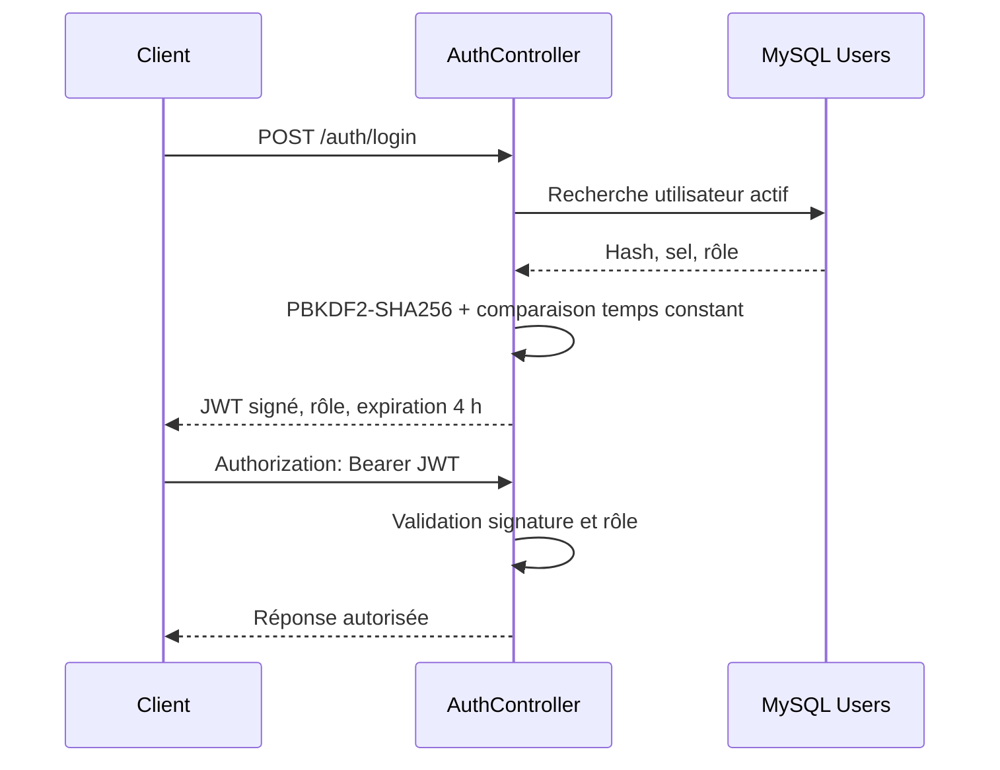

# Authentification et sécurité

## Objectif

Décrire les contrôles réellement présents, les secrets attendus et les risques
prioritaires sans reproduire de valeur sensible.

## Architecture actuelle

### Authentification JWT

Source réutilisable : [authentication.mmd](diagrams/authentication.mmd).

**CONFIRMÉ** :

- mots de passe hachés par PBKDF2-SHA256, sel aléatoire de 16 octets,
  100 000 itérations et clé de 32 octets ;
- signature JWT HMAC-SHA256 ;
- secret JWT obligatoire d’au moins 32 octets hors tests ;
- token utilisateur valable 4 heures ;
- token client credentials valable 2 heures ;
- rôles `Admin` et `Consultation` ;
- politiques `AdminOnly` et `ConsultationOrAdmin`.

**Limites confirmées** :

- validation de l’émetteur et de l’audience désactivée ;
- `RequireHttpsMetadata=false` et `SaveToken=true` ;
- aucun refresh token, révocation, verrouillage, MFA ou rate limiting observé ;
- inscription publique créant directement un compte actif `Consultation` ;
- Swagger activé dans tous les environnements.

### Stockage des tokens

| Client | Stockage observé | Persistance |
|---|---|---|
| HandWStat | propriété `ApiSession` en mémoire | Non |
| Integration | propriété `AccessToken` en mémoire | Non |
| Web | pas de session JWT pour ses fonctions publiques | Sans objet |

HandWStat conserve séparément un identifiant aléatoire dans `Preferences`, puis
envoie son SHA-256 pour le rollout de mise à jour. Ce n’est pas le JWT.

### Autorisation

- lectures métier : `Admin` ou `Consultation` ;
- mutations des référentiels, joueurs, matchs et temps : `Admin` ;
- gestion des releases et versions de composants : `AdminOnly` ;
- login, inscription, métadonnées de release, contrôle de mise à jour et version
  système : anonymes.

`POST /api/client-updates/events` est public. Il valide le contrat mais ne
présente pas de protection anti-abus visible.

### Sécurité Web et artefacts

- Web : antiforgery, redirection HTTPS et HSTS hors développement ;
- affichage d’artefact : URL HTTPS, taille et SHA-256 exigés côté Web ;
- ouverture d’update : URL HTTPS absolue exigée côté HandWStat ;
- API : liste d’hôtes de téléchargement autorisés et taille maximale configurée ;
- registre : champ d’empreinte de signature disponible.

**À CONFIRMER** — la signature des binaires n’est pas vérifiée par le client dans
le code observé ; la présence d’un champ d’empreinte ne prouve pas la signature
ou sa validation.

## Alertes P0

### P0 — SECRET POTENTIELLEMENT EXPOSÉ DANS UNE CONFIGURATION VERSIONNÉE

La valeur n’est pas reproduite dans la documentation.

Actions :

1. rotation immédiate ;
2. suppression de la configuration versionnée ;
3. remplacement par une variable d’environnement ;
4. recherche dans l’historique Git ;
5. nettoyage de l’historique si nécessaire.

Cette alerte concerne la configuration d’Integration.

### P0 — IDENTIFIANTS MYSQL POTENTIELLEMENT EXPOSÉS DANS DES SCRIPTS VERSIONNÉS

La valeur n’est pas reproduite dans la documentation.

Actions :

1. désactiver ou faire tourner immédiatement le compte concerné ;
2. retirer les identifiants des scripts sans exécuter ces scripts ;
3. injecter le secret via un gestionnaire de secrets ou une invite sécurisée ;
4. rechercher l’exposition dans les clones, artefacts et historique Git ;
5. réduire les droits du compte de migration.

### Matrice de sécurité

| Composant | Authentification | Autorisation | Secret attendu | Stockage actuel | Risque principal |
|---|---|---|---|---|---|
| API | JWT Bearer | Rôles/politiques | JWT, MySQL, client credentials | configuration externe attendue | issuer/audience et anti-abus absents |
| HandWStat | Login utilisateur | rôle porté par JWT | mot de passe saisi, JWT mémoire | mémoire | pas de révocation/refresh |
| Integration | Login Admin | contrôle rôle + API | configuration sensible versionnée | fichier copié en sortie | exposition et import partiel |
| Web | Fonctions publiques | aucune session applicative | URL API | configuration | inscription automatisable |
| MySQL | Compte SQL | droits à confirmer | chaîne de connexion | secret externe attendu, scripts à risque | privilèges et rotation inconnus |
| GitHub | HTTPS | droits dépôt à confirmer | jeton/clé locale | hors dépôts analysés | protections de branche inconnues |
| MCP | Non trouvé | Non trouvé | Aucun constat | Sans objet | droits à définir avant tout déploiement |

### CORS, réseau et accès

L’API n’enregistre aucune politique CORS. Le reverse proxy, les règles firewall,
les accès SSH, le compte système de l’API, les droits MySQL et la rotation des
certificats sont **À CONFIRMER**.

Les remotes Git utilisent HTTPS. Les protections de branches, scans de secrets,
Dependabot, règles d’approbation et environnements protégés ne sont pas visibles
dans les dépôts locaux.

### Serveur MCP

Aucun serveur MCP d’écosystème n’a été trouvé. Si un tel serveur est ajouté, il
devra être en lecture seule par défaut, limité à une liste de dépôts, journalisé
et isolé des secrets de production. Tout droit d’écriture ou d’exécution distante
devra exiger une approbation explicite.

## Architecture cible recommandée

- secret manager et rotation automatisée ;
- JWT avec issuer/audience, clés rotatives, courte durée et mécanisme de
  révocation adapté ;
- rate limiting sur login, register et événements publics ;
- validation e-mail et politique de mot de passe/lockout documentée ;
- Swagger restreint hors développement ;
- compte MySQL applicatif sans droit de migration et compte de migration
  temporaire ;
- signature de code Windows/Android et vérification d’intégrité avant
  installation ;
- scans de secrets, dépendances et code dans la CI.

## Sources

- `<HandballManagerAPI>/HandballManagerAPI/Program.cs`
- `<HandballManagerAPI>/HandballManagerAPI/Controllers/AuthController.cs`
- `<HandballManagerAPI>/HandballManagerAPI/Security/PasswordHasher.cs`
- `<HandballManagerAPI>/HandballManagerAPI/Controllers/*`
- `<HandballManagerAPI>/HandballManagerAPI/Services/Releases/*`
- `<HandWStat>/Services/ApiAuthService.cs`, `Services/Updates/*`
- `<HandballIntegration>/HandballIntegration/Services/ApiAuthService.cs`
- configurations et scripts versionnés concernés, valeurs non reproduites

