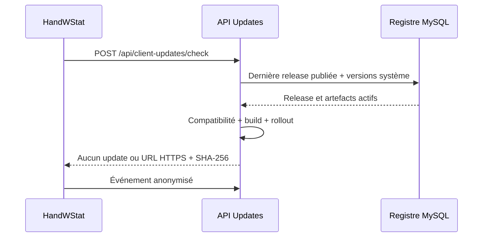

# CI/CD et gestion des releases

## Objectif

Décrire la chaîne réellement disponible du code à la publication, ses contrôles
de compatibilité et la cible recommandée.

## Pipeline actuellement présent

**CONFIRMÉ** — aucun workflow GitHub Actions, GitLab CI, Azure Pipelines,
Jenkinsfile ou autre définition CI active n’a été trouvé dans les dépôts
principaux. Les remotes GitHub existent, mais le dépôt ne prouve ni déclencheur,
ni runner, ni approbation.

Les briques suivantes existent indépendamment :

| Brique | État observé |
|---|---|
| Restore/build/test .NET | Commandes possibles localement, non orchestrées |
| Tests API | Projet xUnit avec serveur ASP.NET de test et EF InMemory |
| Tests HandWStat | Projet xUnit centré sur les mises à jour |
| Tests Web/Integration/Core | Projet dédié non trouvé |
| Packaging HandWStat | Cibles MAUI présentes, script de packaging non trouvé |
| Migration EF MySQL | Migrations présentes, déclenchement normal non automatisé |
| Scripts SQL release | Scripts Oracle présents, incompatibles avec MySQL déclaré |
| Publication de release | Endpoints Admin et registre MySQL présents |
| Copie d’artefact | Endpoint d’upload non trouvé ; transfert manuel probable |
| Déploiement API/Web | Script reproductible non trouvé |
| Smoke tests | Non trouvés |
| Approbation | Non trouvée |
| Rollback applicatif | Non documenté/automatisé |

### Étapes actuellement manuelles

Le cycle le plus vraisemblable, sans le présenter comme une automatisation
existante, est :

1. commit et éventuelle revue GitHub — règles **À CONFIRMER** ;
2. restore, build et tests exécutés manuellement ;
3. version HandWStat fournie par propriétés MSBuild ;
4. génération manuelle des packages Windows/Android ;
5. sauvegarde MySQL — procédure **non trouvée** ;
6. migration choisie et exécutée manuellement ;
7. déploiement API/Web et copie d’artefacts sur le serveur ;
8. création d’une release `DRAFT` par l’API Admin ;
9. ajout des métadonnées d’artefact puis publication ;
10. vérification manuelle via Web et HandWStat.

Les scripts shell MySQL arrêtent puis redémarrent `handapi`. Avec `set -e`, une
erreur après l’arrêt peut interrompre le script avant le redémarrage. Ils
contiennent en outre des identifiants versionnés et ne doivent pas être utilisés
tant que ceux-ci n’ont pas été tournés et retirés.

### Registre et compatibilité

Le registre central suit :

- application, canal, version et état `DRAFT`/`PUBLISHED`/`REVOKED` ;
- plateforme, architecture, type de package et numéro de build ;
- build minimum supporté, mise à jour obligatoire et pourcentage de rollout ;
- versions API minimale/maximale et version de base minimale ;
- URL, nom, taille, SHA-256 et empreinte de signature optionnelle ;
- commit source et notes de release.

HandWStat envoie son application, sa plateforme, son architecture, son canal,
sa version, son build et un identifiant anonymisé. L’API ne propose un artefact
que si la release est publiée, compatible et dans le bucket de rollout. Un build
inférieur au minimum supporté devient obligatoire.

### Gestion des versions

| Composant | Source de version |
|---|---|
| HandWStat | `ApplicationDisplayVersion`, `ApplicationVersion`, propriétés MSBuild ; défauts `1.0.0`/`1` |
| API | version d’assembly/informationnelle et variable `APP_GIT_COMMIT_SHA` |
| Base | dernière migration réussie du registre de version |
| Composants | `SYS_COMPONENT_VERSION` mis à jour par endpoint Admin |
| Artefacts | version sémantique de release + build entier croissant |
| Core | aucune stratégie de package/version indépendante ; référence source |

### Rollback actuel

- une release peut être révoquée par l’endpoint Admin ;
- le registre conserve les autres releases publiées ;
- aucun mécanisme prouvé ne restaure automatiquement code API/Web, fichiers ou
  base ;
- le script Oracle de suppression du registre n’est pas un rollback MySQL et
  détruit les données ;
- la procédure sûre reste **À CONFIRMER** pour chaque composant.

## Pipeline cible recommandé

```mermaid
flowchart LR
    Commit --> PR[Pull Request]
    PR --> Build
    Build --> Tests
    Tests --> Package
    Package --> Backup[Backup MySQL]
    Backup --> Migrate[Migration sur clone puis staging]
    Migrate --> Staging[Déploiement staging]
    Staging --> Smoke[Smoke tests]
    Smoke --> Approval[Approbation]
    Approval --> Production
    Production --> Verify[Vérification + métriques]
    Verify -->|échec| Rollback[Rollback versionné]
```

Source réutilisable : [release-target.mmd](diagrams/release-target.mmd).

### Contrôles cibles

| Étape | Contrôle minimal |
|---|---|
| PR | revue obligatoire, scan de secrets et dépendances |
| Build | SDK épinglé, Core reproductible, builds Windows/Android |
| Tests | API + HandWStat + contrats + smoke Web |
| Package | signature, SHA-256, SBOM, conservation immuable |
| Base | sauvegarde vérifiée, migration MySQL unique, test de restauration |
| Staging | configuration distincte, données anonymisées |
| Production | environnement protégé et approbation |
| Publication | artefact copié avant métadonnées ; validation HEAD/SHA/signature |
| Rollback | version N-1, révocation release, restauration DB seulement si conçue |

## Secrets et approbations

**Architecture actuelle** — aucun coffre de secrets, environnement CI protégé ou
approbation automatisée n’est visible. Les deux expositions P0 décrites dans le
document sécurité doivent être traitées avant toute automatisation.

**CIBLE RECOMMANDÉE** — identités de workload à durée courte, secrets par
environnement, approbation production et journal d’audit.

## Sources

- `.csproj` et projets de tests des composants actifs
- `<HandWStat>/Directory.Build.props`
- `<HandWStat>/Services/Updates/*`
- `<HandballManagerAPI>/HandballManagerAPI/Controllers/AdminReleasesController.cs`
- `<HandballManagerAPI>/HandballManagerAPI/Controllers/ClientUpdatesController.cs`
- `<HandballManagerAPI>/HandballManagerAPI/Services/Updates/*`
- `<HandballManagerAPI>/HandballManagerAPI/Repositories/Releases/*`
- `<HandballManagerAPI>/database/migrations/*`
- `<HandballManagerAPI>/apply-migration.sh`, `check-schema.sh`

