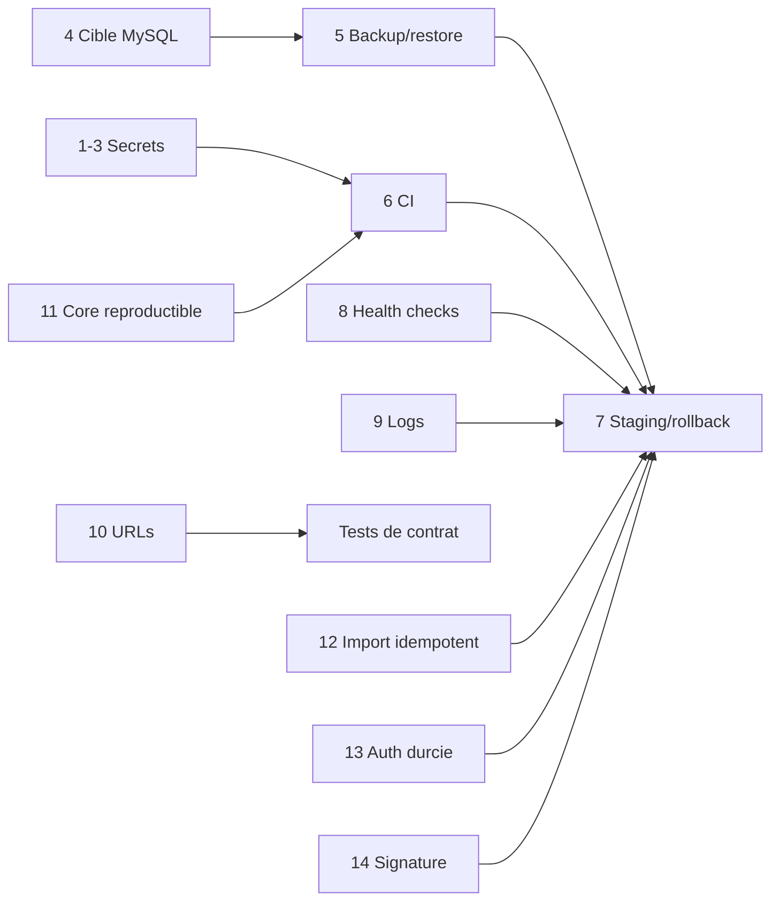

# Risques et roadmap

## Objectif

Prioriser les écarts constatés et proposer un plan de réduction du risque limité
aux quinze actions les plus importantes.

## Architecture actuelle — registre des risques

### P0 — critique

| Risque | Composant | Impact |
|---|---|---|
| Secret client dans une configuration versionnée | Integration | Usurpation potentielle ; rotation et historique requis |
| Identifiants MySQL dans des scripts versionnés | Base/exploitation | Accès base potentiel et diffusion dans clones/artefacts |

Les valeurs ne sont pas reproduites.

### P1 — important

| Risque | Composant | Impact |
|---|---|---|
| Scripts Oracle mêlés à une cible MySQL | Base/releases | Échec ou action sur le mauvais moteur |
| Sauvegarde/restauration non documentée | MySQL | Perte de données, RPO/RTO inconnus |
| Aucun pipeline CI/CD actif | Tous | Builds et déploiements non reproductibles |
| Déploiement et rollback non automatisés | API/Web/clients | MTTR élevé, erreur humaine |
| Pas de health checks ni supervision | Serveur | Détection tardive |
| Logs dispersés et locaux | API/Web/Integration | Diagnostic et audit difficiles |
| Import multi-requêtes non atomique | Integration/API | Match partiel après interruption |
| Composition incohérente des routes `/api` | HandWStat/Integration | Échecs dépendants du proxy |
| JWT sans issuer/audience/rate limiting | API | Surface d’abus et contrôle de token limité |
| Core référencé depuis des chemins de dépôts | Tous | Build multi-machine fragile |
| MySQL potentiellement point unique | Base | Indisponibilité globale |

### P2 — amélioration

| Risque | Composant | Impact |
|---|---|---|
| Couplage modèles EF/DTO dans Core | API/clients | Évolutions contractuelles risquées |
| Tests absents pour Web, Integration et Core | Qualité | Régressions non détectées |
| Signature d’artefact non vérifiée côté client | Releases | Intégrité d’installation incomplète |
| Swagger public et événements update anonymes publics | API | Reconnaissance et abus |
| Pas de cache explicite sur analytics/référentiels | API | Charge et latence potentielles |
| Rétention des événements update non définie | Base | Croissance et conformité |

### P3 — confort

- statuts et propriétaires des applications historiques non formalisés ;
- nomenclature française/anglaise et pluriels de tables hétérogènes ;
- documentation d’exploitation auparavant fragmentaire.

## Architecture cible recommandée — roadmap

| Priorité | Action | Composant | Bénéfice | Complexité | Validation |
|---:|---|---|---|---|---|
| 1 | Tourner les deux catégories d’identifiants exposés et invalider les anciens | Sécurité | Ferme l’exposition P0 | M | Anciennes valeurs refusées, audit terminé |
| 2 | Retirer les secrets de Git et nettoyer l’historique/artefacts selon procédure | Tous dépôts | Réduit la diffusion | H | Scan historique sans secret actif |
| 3 | Déployer un gestionnaire de secrets et des comptes à moindre privilège | API/Integration/MySQL | Rotation et séparation des droits | M | Aucun secret dans fichiers/builds |
| 4 | Désigner MySQL comme cible et quarantainer/réécrire les scripts Oracle | Base | Évite les migrations incompatibles | M | Migration testée sur clone MySQL |
| 5 | Mettre en place sauvegardes, rétention, RPO/RTO et tests de restauration | MySQL/stockage | Reprise après sinistre | H | Restauration chronométrée réussie |
| 6 | Créer une CI reproductible avec SDK épinglés, scans, builds et tests | Tous | Qualité et traçabilité | H | Build propre depuis clone |
| 7 | Ajouter staging, approbation, smoke tests et rollback N-1 | Déploiement | Réduit le risque production | H | Exercice rollback réussi |
| 8 | Ajouter health checks, métriques et alertes | API/Web/MySQL | Détection rapide | M | Alertes live/ready testées |
| 9 | Centraliser les logs structurés avec corrélation et rétention | Tous | Diagnostic/audit | M | Incident traçable de bout en bout |
| 10 | Unifier la composition des URL et tester tous les clients | HandWStat/Integration/Web | Supprime les doubles `/api` | S | Tests de contrat sur base publique |
| 11 | Rendre Core reproductible : package versionné ou monorepo | Core/consommateurs | Builds portables | M | Build sans `D:\repos` |
| 12 | Rendre les imports idempotents et transactionnels/compensables | Integration/API | Évite les données partielles | H | Relance contrôlée sans doublon |
| 13 | Durcir auth : issuer/audience, rate limiting, lockout et révocation | API | Réduit abus et vol de token | M | Tests 401/403/429 et rotation |
| 14 | Signer les packages et vérifier signature/SHA avant installation | Releases/HandWStat | Intégrité de distribution | H | Artefact altéré refusé |
| 15 | Concevoir disponibilité/capacité MySQL et purge des événements | MySQL | Résilience et maîtrise de croissance | H | Test de bascule/capacité et purge |

Complexité : S = faible, M = moyenne, H = élevée.

## Dépendances de la roadmap

## Risques résiduels et éléments à confirmer

- architecture physique, reverse proxy, firewall, TLS et propriétaires ;
- volumétrie, performance et index réellement utilisés en production ;
- RPO/RTO métier ;
- statut et contenu d’une éventuelle CI distante non présente localement ;
- présence d’un MCP hors des dépôts accessibles ;
- statut de retrait des anciens clients.

## Sources

- ensemble des sources citées dans les documents 01 à 07 ;
- états Git et remotes relevés au début de mission ;
- contextes Repomix sûrs, utilisés comme index, fichiers réels comme vérité.

